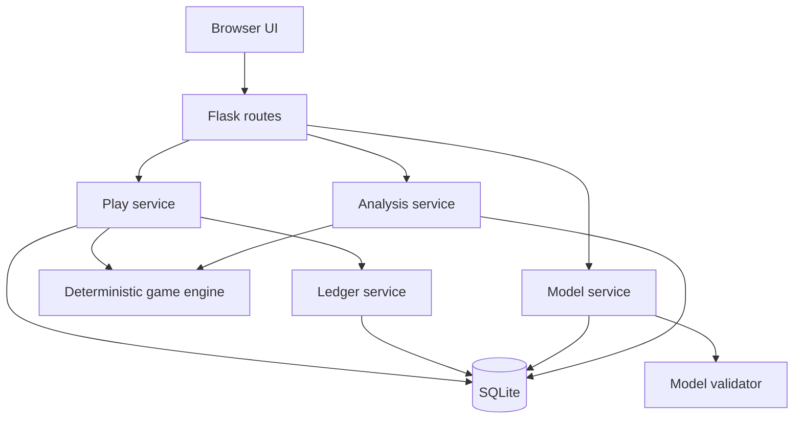
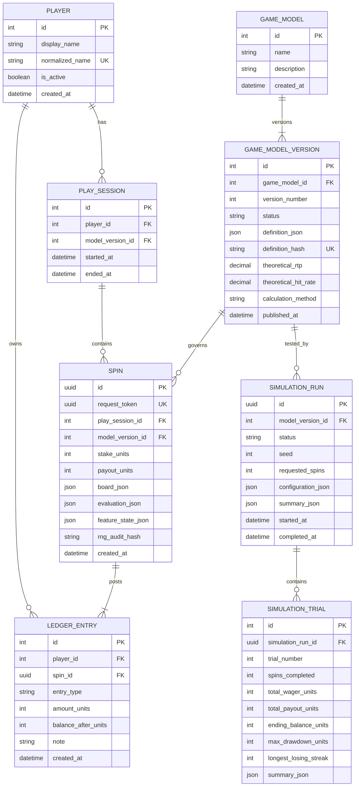

# 3. Architecture and Data Design

## 3.1 Architecture

Use a local Flask application with clear layers:



The game engine is a pure Python domain package. It must not import Flask, SQLAlchemy models, or UI code. Given a validated model, stake, RNG source, and optional feature state, it returns a complete outcome object.

## 3.2 Recommended repository structure

```text
slot-statistics-lab/
├── app/
│   ├── __init__.py
│   ├── config.py
│   ├── extensions.py
│   ├── models/
│   ├── routes/
│   │   ├── players.py
│   │   ├── play.py
│   │   ├── analysis.py
│   │   ├── game_models.py
│   │   └── exports.py
│   ├── services/
│   │   ├── ledger_service.py
│   │   ├── play_service.py
│   │   ├── simulation_service.py
│   │   ├── statistics_service.py
│   │   └── model_service.py
│   ├── game_engine/
│   │   ├── schemas.py
│   │   ├── rng.py
│   │   ├── reels.py
│   │   ├── evaluator.py
│   │   ├── features.py
│   │   └── theoretical.py
│   ├── templates/
│   └── static/
├── migrations/
├── instance/
├── tests/
│   ├── unit/
│   ├── integration/
│   └── statistical/
├── scripts/
├── docs/
├── pyproject.toml
├── .env.example
└── README.md
```

## 3.3 Entity relationship model



## 3.4 Key constraints and invariants

- `normalized_name` is unique.
- Money-like values are integer units and stakes/payouts are non-negative; ledger debits are negative.
- A completed spin has exactly one wager ledger entry and zero or one payout entry.
- The wager amount equals negative `spin.stake_units`.
- A payout entry, when present, equals `spin.payout_units`.
- A player’s balance equals the ordered sum of ledger amounts.
- Ledger rows are never updated or deleted through normal application services.
- Published game-model versions are immutable.
- `(game_model_id, version_number)` is unique.
- A spin references one published model version.
- Simulation trials never reference or mutate a player or participant ledger.
- All timestamps are stored as UTC and displayed in local browser time.

## 3.5 Transaction sequence for a spin

1. Receive player, session, stake, and unique request token.
2. Begin database transaction and re-check the token.
3. Confirm active session, published model, permitted stake, and sufficient ledger balance.
4. Generate the outcome using the server-side RNG adapter.
5. Store the spin and full evaluation.
6. Append wager debit and payout credit, including balance-after snapshots.
7. Commit once.
8. Return result and recalculated summary.

If any step fails, roll back all spin and ledger changes.

## 3.6 Randomness and auditability

Use Python’s `secrets.SystemRandom` or a `random.Random` instance seeded from cryptographic random bytes for participant play. Store an audit hash of non-secret generation metadata, not a value that lets the browser predict future spins.

Simulation runs use a deterministic `random.Random(seed)` or NumPy `Generator(PCG64(seed))`, with the generator name and version recorded. Exact reproduction is guaranteed only within the documented generator/algorithm version.

